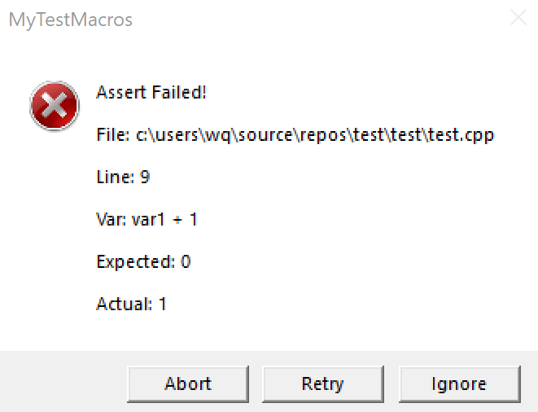

# MyTestMacros


自己在写MFC程序的时候为了方便测试做的，因为VERIFY()的输出没有实际值，以及变量名什么的（其实主要是为了想能够Release运行的时候也可以输出错误，比较好测试），不知道大家是怎么做的，有没有更好的办法。

* 依赖mfc

## 包括的宏

在以下宏中，b为待测量，a为常量,因此在Release模式只会运行b。

* NORMAL系列
	* VERIFY\_EQUAL(a, b)
	* VERIFY\_GREATER(a, b)
	* VERIFY\_LESS(a, b)
	* VERIFY\_GREATER\_EQUAL(a, b)
	* VERIFY\_LESS\_EQUAL(a, b)
* EX系列
	* VERIFY\_EQUA\L_EX(a, b)
	* VERIFY\_GREATER\_EX(a, b)
	* VERIFY\_LESS\_EX(a, b)
	* VERIFY\_GREATER\_EQUAL\_EX(a, b)
	* VERIFY\_LESS\_EQUAL\_EX(a, b)


---
 * NORMAL系列只输出变量名，所以适用能够对应比较运算符操作的类型。
 * EX系列会输出b的值，适用能够对应比较运算符操作并且能够`<<`操作的类型。


## 示例

```
​```
int var1 = 0;  
VERIFY_EUQAL(0, var1 + 1);

​```


```


效果如图  
  
    
其他几个宏也是类似用法
